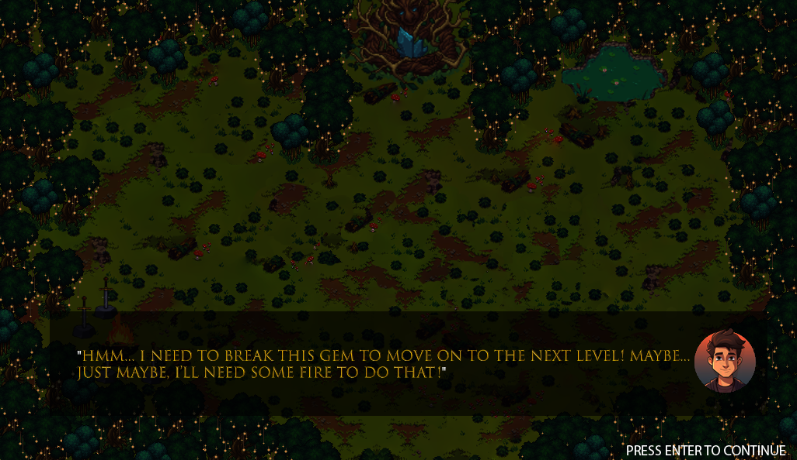

# PIXEL ALCHEMIST

## Game Description

->Pixel Alchemist is a 2D adventure puzzle game where players must harness the power of the elements to guide a lost character home safely. Trapped in a mysterious forest, the character must merge Fire, Air, Water, and Earth in the correct sequence to overcome obstacles and advance through levels.

## Features
->Elemental Merging Mechanic – Combine elements in specific ways to unlock new paths and solve puzzles. 
->Challenging Collecting System – Elements must be gathered in the correct order to progress. 
->Immersive Forest Environment – Explore a beautifully designed pixel-art world. 
->Dynamic Hints & Instructions – Get subtle guidance when needed to avoid getting stuck. 
->Engaging Puzzle Complexity – Each level presents new challenges and interactions between elements. 

## Project Details
->IDE: Visual studio 2010/2013 
->Language: C,C++. 
->Platform : Windows PC. 
->Genre : 2D action adventure 

## How to Run the Project
Make sure you have the following installed:
-> **Visual Studio 2013 
-> **MinGW Compiler** (if needed) 
-> **iGraphics Library** (included in this repository) 

Open the project in Visual Studio 2013  
-> Open Visual Studio 2013. 
-> Go to File → Open → Project/Solution. 
-> Locate and select the .sln file from the cloned repository. 
-> Click Build → Build Solution 
-> Run the program by clicking Debug → Start Without Debugging 

## How to Play

| Player       | Move Left | Move Right | Move Up       | Move Down | Collect|
|-------------|----------|-----------|-----------|-------|------|
| **Player 1** | `A`      | `D`       | `W`       | `S`   | `X`  |

### **Game Rules**
->Players must collect Fire, Air, Water, and Earth in a specific sequence to proceed. 
->Merging the wrong elements can lead to unexpected results or level resets. 
->Some elements require puzzles to unlock before they can be obtained. 
->Players will receive hints if they struggle to find the right path. 

## Project Contributors
1. Mubasshir Ahin
2. Sadman Mahin
3. Ahona Zabin

## Screenshots

### **Figure 1: Creating Fire + Water to produce steam that removes the fog.**

### **Figure 2: Inventory system that helps track collected elements.**

### **Figure 3: Breaking the gem with the correct sequence of elements.**

### **Figure 4: Level progression and current level**

### **Figure 5: Removing a brick to collect water from the waterfall.**

### **Figure 6: Creating lava to defeat plant enemies.**

### **Figure 7: Instructions to give player a little push.**,

### **Figure 8: Final confrontation with the boat guardian.**

### **Character**

## Youtube Link
[CSE 1200 Project: The Fallen Kingdom](https://www.youtube.com/)

## Project Report
[Project Report: Pixel Alchemist](https://drive.google.com/file/d/1U3aIyCNhHdOQCzBb3bQ4HdH6kWl0DGhD/view?usp=sharing)
